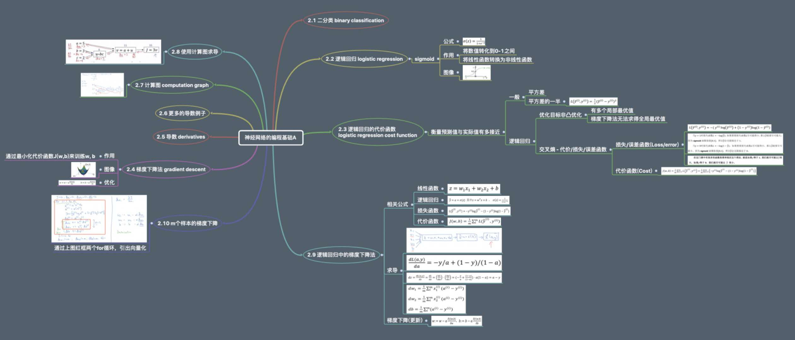
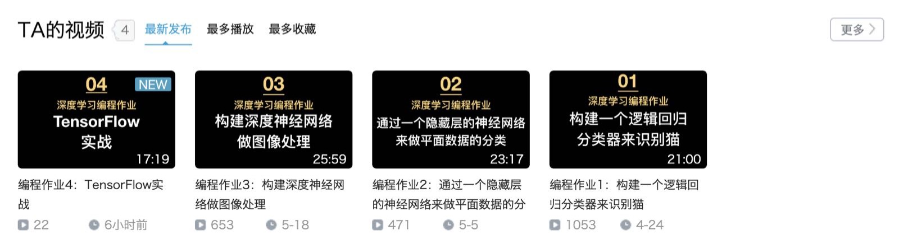

<h1 align="center">《深度学习》学习笔记(xmind)、代码、代码视频讲解</h1>

## 入门指南
- [**深度之眼学员入口**](./guide/guide.md)

## 笔记

xmind整理的笔记，持续更新中...

- [**C1W2 神经网络的编程基础A.xmind**](./xmind/C1W2/C1W2%20神经网络的编程基础A.xmind)
- [**C1W2 神经网络的编程基础B.xmind**](./xmind/C1W2/C1W2%20神经网络的编程基础B.xmind)
- [**C1W3 浅层神经网络A.xmind**](./xmind/C1W3/C1W3%20浅层神经网络A.xmind)
- [**C1W3 浅层神经网络B.xmind**](./xmind/C1W3/C1W3%20浅层神经网络B.xmind)
- [**C1W4 深层神经网络A.xmind**](./xmind/C1W4/C1W4%20深度神经网络A.xmind)
- [**C1W4 深层神经网络B.xmind**](./xmind/C1W4/C1W4%20深度神经网络B.xmind)
- [**C2W1 深度学习的实践A.xmind**](./xmind/C2W1/C2W1深度学习的实践A.xmind)
- [**C2W1 深度学习的实践B.xmind**](./xmind/C2W1/C2W1深度学习的实践B.xmind)
- [**C2W2 优化算法.xmind**](./xmind/C2W2/C2W2%20优化算法.xmind)
- [**C2W3 超参数调试、正则化以及优化.xmind**](./xmind/C2W3/C2W3%20超参数调试、正则化以及优化.xmind)
- [**C3W1 机器学习（ML）策略（1）.xmind**](./xmind/C3W1/C3W1%20机器学习（ML）策略（1）.xmind)
- [**C3W2 机器学习（ML）策略（2）.xmind**](./xmind/C3W2/C3W2%20机器学习（ML）策略（2）.xmind)
- [**C4W1 卷积神经网络.xmind**](./xmind/C4W1/C4W1%20卷积神经网络.xmind)

## 测验

---
英文版本
- [**C1W1 深度学习引言【无答案】**](./trials/C1W1_noAnswers_EnVer.md)
- [**C1W2 神经网络的编程基础【无答案】**](./trials/C1W2_noAnswers_EnVer.md)
- [**C1W3 浅层神经网络【无答案】**](./trials/C1W3_noAnswers_EnVer.md)
- [**C1W4 深层神经网络【无答案】**](./trials/C1W4_noAnswers_EnVer.md)
- [**C2W1 深度学习的实践【无答案】**](./trials/C2W1_noAnswers_EnVer.md)
- [**C2W2 优化算法【无答案】**](./trials/C2W2_noAnswers_EnVer.md)
- [**C2W3 超参数调整、批量标准化、编程框架【无答案】**](./trials/C2W3_noAnswers_EnVer.md)
- [**C3W1 和平之城中的鸟类识别(案例研究)【无答案】**](./trials/C3W1_noAnswers_EnVer.md)
- [**C3W2 自动驾驶（案例研究）【无答案】**](./trials/C3W2_noAnswers_EnVer.md)
- [**C4W1 卷积神经网络的基本知识【无答案】**](./trials/C4W1_noAnswers_EnVer.md)
- [**C4W2 深度卷积网络模型【无答案】**](./trials/C4W2_noAnswers_EnVer.md)
- [**C4W3 目标检测算法【无答案】**](./trials/C4W3_noAnswers_EnVer.md)
- [**C4W4 人脸识别与神经风格迁移【无答案】**](./trials/C4W4_noAnswers_EnVer.md)
- [**C5W1 循环神经网络【无答案】**](./trials/C5W1_noAnswers_EnVer.md)
- [**C5W2 自然语言处理与词嵌入【无答案】**](./trials/C5W2_noAnswers_EnVer.md)
- [**C5W3 序列模型与注意力机制【无答案】**](./trials/C5W3_noAnswers_EnVer.md)

---
中文版本
- [**C1W1 深度学习引言【无答案】**](./trials/C1W1_noAnswers.md)
- [**C1W2 神经网络的编程基础【无答案】**](./trials/C1W2_noAnswers.md)
- [**C1W3 浅层神经网络【无答案】**](./trials/C1W3_noAnswers.md)
- [**C1W4 深层神经网络【无答案】**](./trials/C1W4_noAnswers.md)
- [**C2W1 深度学习的实践【无答案】**](./trials/C2W1_noAnswers.md)
- [**C2W2 优化算法【无答案】**](./trials/C2W2_noAnswers.md)
- [**C2W3 超参数调整、批量标准化、编程框架【无答案】**](./trials/C2W3_noAnswers.md)
- [**C3W1 和平之城中的鸟类识别(案例研究)【无答案】**](./trials/C3W1_noAnswers.md)
- [**C3W2 自动驾驶（案例研究）【无答案】**](./trials/C3W2_noAnswers.md)
- [**C4W1 卷积神经网络的基本知识【无答案】**](./trials/C4W1_noAnswers.md)
- [**C4W2 深度卷积网络模型【无答案】**](./trials/C4W2_noAnswers.md)
- [**C4W3 目标检测算法【无答案】**](./trials/C4W3_noAnswers.md)
- [**C4W4 人脸识别与神经风格迁移【无答案】**](./trials/C4W4_noAnswers.md)
- [**C5W1 循环神经网络【无答案】**](./trials/C5W1_noAnswers.md)
- [**C5W2 自然语言处理与词嵌入【无答案】**](./trials/C5W2_noAnswers.md)
- [**C5W3 序列模型与注意力机制【无答案】**](./trials/C5W3_noAnswers.md)
---
中文版本答案
- [**C1W1 深度学习引言【有答案】**](./trials/C1W1_withAnswers.md)
- [**C1W2 神经网络的编程基础【有答案】**](./trials/C1W2_withAnswers.md)
- [**C1W3 浅层神经网络【有答案】**](./trials/C1W3_withAnswers.md)
- [**C1W4 深层神经网络【有答案】**](./trials/C1W4_withAnswers.md)
- [**C2W1 深度学习的实践【有答案】**](./trials/C2W1_withAnswers.md)
- [**C2W2 优化算法【有答案】**](./trials/C2W2_withAnswers.md)
- [**C2W3 超参数调整、批量标准化、编程框架【有答案】**](./trials/C2W3_withAnswers.md)
- [**C3W1 和平之城中的鸟类识别(案例研究)【有答案】**](./trials/C3W1_withAnswers.md)
- [**C3W2 自动驾驶（案例研究）【有答案】**](./trials/C3W2_withAnswers.md)
- [**C4W1 卷积神经网络的基本知识【有答案】**](./trials/C4W1_withAnswers.md)
- [**C4W2 深度卷积网络模型【有答案】**](./trials/C4W2_withAnswers.md)
- [**C4W3 目标检测算法【有答案】**](./trials/C4W3_withAnswers.md)
- [**C4W4 人脸识别与神经风格迁移【有答案】**](./trials/C4W4_withAnswers.md)
- [**C5W1 循环神经网络【有答案】**](./trials/C5W1_withAnswers.md)
- [**C5W2 自然语言处理与词嵌入【有答案】**](./trials/C5W2_withAnswers.md)
- [**C5W3 序列模型与注意力机制【有答案】**](./trials/C5W3_withAnswers.md)
---

## 代码
代码文件需解压后用ipython notebook打开

- [**C1W2 编程作业1：构建一个逻辑回归分类器来识别猫【无答案】**](./assignment/assignment_noAnswers/C1/assignment2(C1W2).zip)
- [**C1W2 编程作业1：构建一个逻辑回归分类器来识别猫【有答案】**](./assignment/assignment_withAnswers/C1/assignment2(C1W2).zip)
- [**C1W3 编程作业2：通过一个隐藏层的神经网络来做平面数据的分类【无答案】**](./assignment/assignment_noAnswers/C1/assignment3(C1W3).zip)
- [**C1W3 编程作业2：通过一个隐藏层的神经网络来做平面数据的分类【有答案】**](./assignment/assignment_withAnswers/C1/assignment3(C1W3).zip)
- [**C1W4 编程作业3：构建深度神经网络做图像处理【无答案】**](./assignment/assignment_noAnswers/C1/assignment4(C1W4).zip)
- [**C1W4 编程作业3：构建深度神经网络做图像处理【有答案】**](./assignment/assignment_withAnswers/C1/assignment4(C1W4).zip)
- [**C2W1 选修作业：深度学习的实践【无答案】**](./assignment/assignment_noAnswers/C2/Practical%20aspects%20of%20Deep%20Learning.zip)
- [**C2W1 选修作业：深度学习的实践【有答案】**](./assignment/assignment_withAnswers/C2/Practical%20aspects%20of%20Deep%20Learning.zip)
- [**C2W2 选修作业：优化算法【无答案】**](./assignment/assignment_noAnswers/C2/Optimization%20methods.zip)
- [**C2W2 选修作业：优化算法【有答案】**](./assignment/assignment_withAnswers/C2/Optimization%20methods.zip)
- [**C2W3 编程作业4：TensorFlow实战【无答案】**](./assignment/assignment_noAnswers/C2/Tensorflow%20Tutorial)
- [**C2W3 编程作业4：TensorFlow实战【有答案】**](./assignment/assignment_withAnswers/C2/Tensorflow%20Tutorial)
- [**C4W1 编程作业5：一步步构建卷积神经网络【无答案】**](./assignment/assignment_noAnswers/C4/Convolution%20model%20Application.zip)
- [**C4W1 编程作业5：一步步构建卷积神经网络【有答案】**](./assignment/assignment_withAnswers/C4/Convolution%20model%20Application.zip)
- [**C4W2 编程作业6：利用Keras框架构建残差网络【无答案】**](./assignment/assignment_noAnswers/C4/KerasAndResNets)
- [**C4W2 编程作业6：利用Keras框架构建残差网络【有答案】**](./assignment/assignment_withAnswers/C4/KerasAndResNets)
- [**C4W3 编程作业7：自动驾驶—目标检测（yolo模型）**](./assignment/assignment_withAnswers/C4/Car%20Detection/README.md)
- [**C4W4 编程作业8：特殊应用(人脸识别和神经风格迁移)**](./assignment/assignment_withAnswers/C4/Face%20Recognition&Neural%20Style%20Transfer/README.md)
- [**C5W1 编程作业9：字符级语言模型 - 恐龙岛【无答案】**](./assignment/assignment_noAnswers/C5/dinosaurus%20island.zip)
- [**C5W1 编程作业9：字符级语言模型 - 恐龙岛【有答案】**](./assignment/assignment_withAnswers/C5/dinosaurus%20island.zip)
- [**C5W1 编程作业10：使用LSTM即兴演奏Jazz Solo【无答案】**](./assignment/assignment_noAnswers/C5/Jazz%20improvisation%20with%20LSTM.zip)
- [**C5W1 编程作业10：使用LSTM即兴演奏Jazz Solo【有答案】**](./assignment/assignment_withAnswers/C5/Jazz%20improvisation%20with%20LSTM.zip)
- [**C5W2 编程作业11：词向量运算**](./assignment/assignment_withAnswers/C5/Word%20Vector%20Representation/README.md)
- [**C5W2 编程作业12：Emoji表情生成器**](./assignment/assignment_withAnswers/C5/Emojify/README.md)

## 代码讲解视频(bilibili)
**bilibili主页** : https://space.bilibili.com/10410626

- [**C1W2 编程作业1：构建一个逻辑回归分类器来识别猫**](https://www.bilibili.com/video/av50307869)
- [**C1W3 编程作业2：通过一个隐藏层的神经网络来做平面数据的分类**](https://www.bilibili.com/video/av51486088)
- [**C1W4 编程作业3：构建深度神经网络做图像处理**](https://www.bilibili.com/video/av52785212)
- [**C2W3 编程作业4：TensorFlow实战**](https://www.bilibili.com/video/av54668655)
- [**C4W1 编程作业5：一步步构建卷积神经网络**](https://www.bilibili.com/video/av56250374)
- [**C4W2 编程作业6：利用Keras框架构建残差网络**](https://www.bilibili.com/video/av57062905)
- [**C4W3 编程作业7：自动驾驶—目标检测（yolo模型）**](https://www.bilibili.com/video/av58025877)
- [**C4W4 编程作业8：特殊应用(人脸识别和神经风格迁移)**](https://www.bilibili.com/video/av58152812)
- [**C5W1 编程作业9：字符级语言模型 - 恐龙岛**](https://www.bilibili.com/video/av59087993)

## 课程地址

[deeplearning.ai - 主页 - 网易云课堂](https://study.163.com/provider/2001053000/index.htm)
