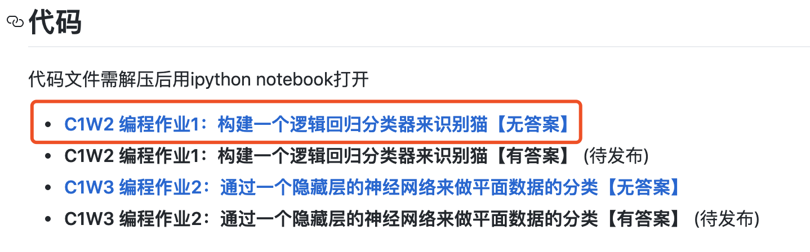
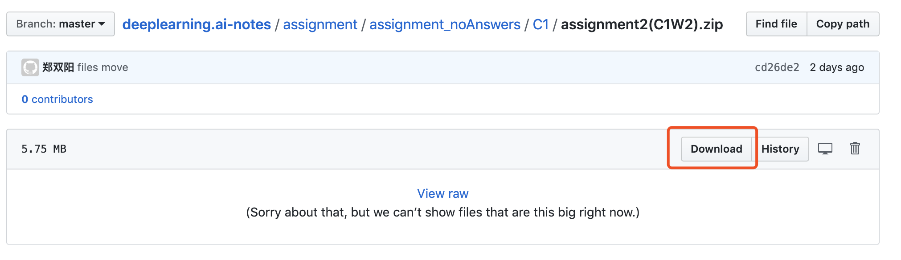
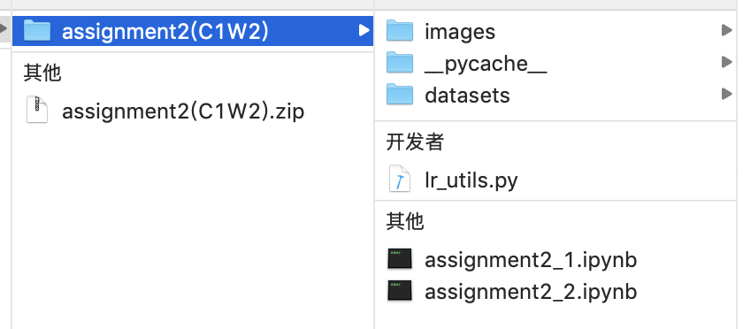
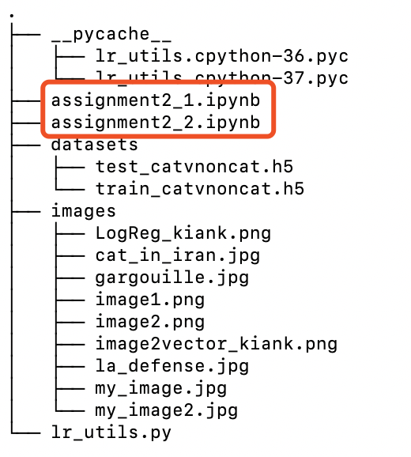
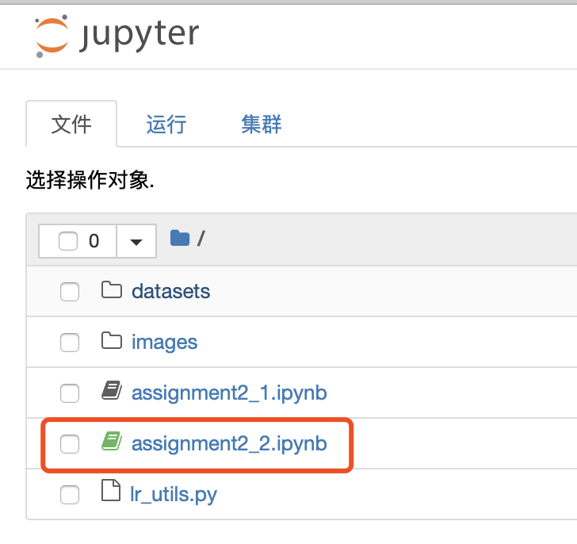
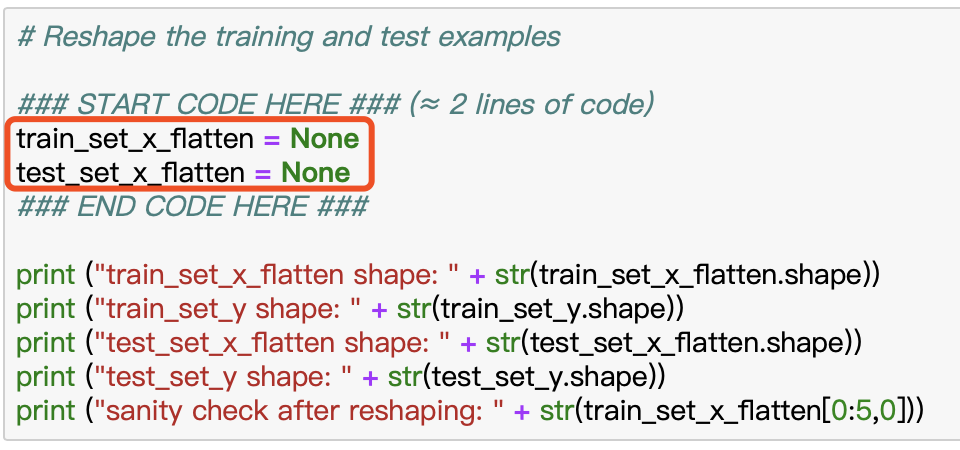
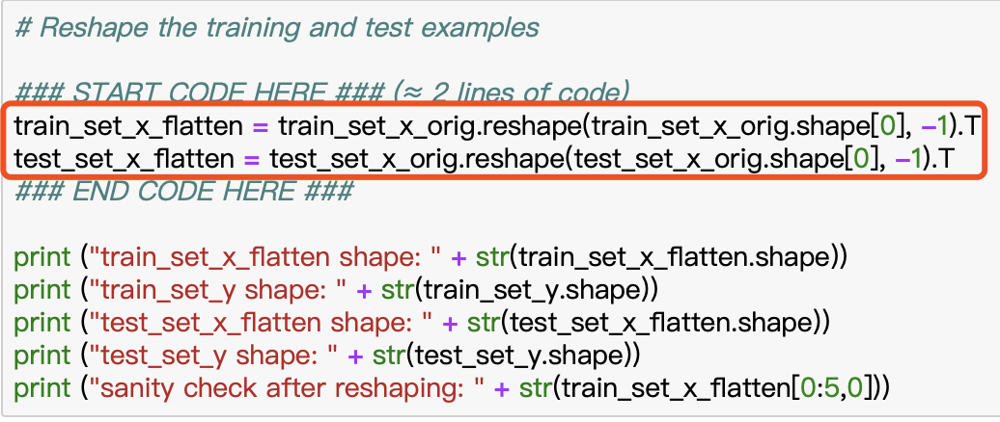
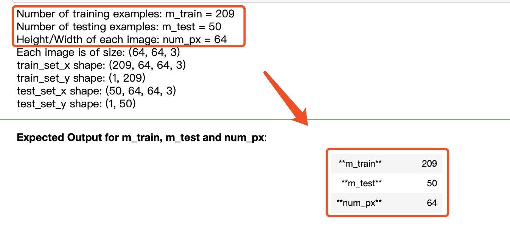

<h1 align="center">学习指南</h1>

## 如何获取每日任务


1. 打开"深度之眼"【公众号】，点击 训练营-【小程序】
2. 选择【对应课程】进入对应的训练营小程序
3. 选择顶端【日期】，查看【每日任务】
    ```diff
        第一次进入这个小程序的同学找到【最早的日期】，认真观看【开营仪式】)
    ```
4. 每日打卡任务可以【全文复制】下来，将文字发送到电脑端方便操作


## 编程环境配置

实验环境推荐使用Linux或者Mac系统，以下环境搭建方法皆适用:
- [**本地配置【非常重要】**](https://github.com/learning511/cs224n-learning-camp/blob/master/environment.md)

    ```diff
        前四次编程作业无需用到tensorflow
        同学们可先安装好ipython-notebook
        待第五次编程作业时再安装tensorflow
        安装方式不拘泥于上述文档，可搜索适合自己的安装方式
    ```

## 编程作业怎么做？

1.打开 [**https://github.com/greebear/deeplearning.ai-notes**](https://github.com/learning511/cs224n-learning-camp/blob/master/environment.md)找到本次作业，或通过小程序中发布的网盘链接下载编程作业。






2.下载并解压压缩包，可以看到这样的目录(以第一次编程作业为例)。


3.第一次编程作业的目录列表如下图所示，红框处为本次作业需要填写代码的文件。



4.打开 **ipython(jupyter) notebook** ，进入后如下图所示。红框处为第一次编程作业"C1W2 编程作业1：构建一个逻辑回归分类器来识别猫"




5.点击进入后，可以看到许多代码，找到下面的【注释内容】，我们需要在中间填入代码。


    ### START CODE HERE ###
    ### END CODE HERE ###


比如：  



我们需要修改None为自己编程的代码



6.运行代码块后，查看输出结果，与下面的答案校验。


7.恭喜你，答对了！

