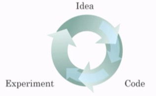
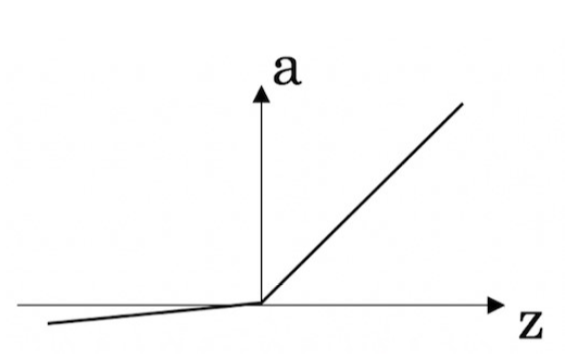

<h1 align="center">C1W1 深度学习引言</h1>

## 测验
___
> 1、“AI是新电力”这个比喻是指什么？
- [ ] 就像100年前产生电能一样，AI正在改变很多的行业。
- [ ] AI为我们的家庭和办公室的个人设备供电，类似于电力。
- [ ] 通过“智能电网”，AI提供新的电能。
- [ ] AI在计算机上运行，​​并由电力驱动，但是它正在让以前的计算机不能做的事情变为可能。
___
> 2、哪些是深度学习快速发展的原因？ (三个选项)
- [ ] 我们现在可以获得更多的数据。
- [ ] 深度学习已经取得了重大的进展，比如在在线广告、语音识别和图像识别方面有了很多的应用。
- [ ] 神经网络是一个全新的领域。
- [ ] 现在我们有了更好更快的计算能力。
___
> 3、回想一下关于不同的机器学习思想的迭代图。下面哪(个/些)陈述是正确的？

- [ ] 能够让深度学习工程师快速地实现自己的想法。
- [ ] 在更好更快的计算机上能够帮助一个团队减少迭代(训练)的时间。
- [ ] 在数据量很多的数据集上训练上的时间要快于小数据集。
- [ ] 使用更新的深度学习算法可以使我们能够更快地训练好模型（即使更换CPU / GPU硬件）。
___
> 4、当一个经验丰富的深度学习工程师在处理一个新的问题的时候，他们通常可以利用先前的经验来在第一次尝试中训练一个表现很好的模型，而不需要通过不同的模型迭代多次从而选择一个较好的模型，这个说法是正确的吗？
- [ ] 正确
- [ ] 错误
___
> 5、这些图中的哪一个表示ReLU激活功能？
- [ ] 图1

- [ ] 图2

- [ ] 图3

- [ ] 图4

___
> 6、用于识别猫的图像是“结构化”数据的一个例子，因为它在计算机中被表示为结构化矩阵，是真的吗？
- [ ] 正确
- [ ] 错误
___
> 7、人口统计数据集, 包含不同城市人口、人均GDP、经济增长的数据集是“非结构化”数据的一个例子，因为它包含来自不同来源的数据，是真的吗？
- [ ] 正确
- [ ] 错误
___

> 8、为什么在上RNN（循环神经网络）可以应用机器翻译将英语翻译成法语？
- [ ] 因为它可以被用做监督学习。
- [ ] 严格意义上它比卷积神经网络（CNN）效果更好。
- [ ] 它比较适合用于当输入/输出是一个序列的时候（例如：一个单词序列）
- [ ] RNNs代表递归过程：想法->编码->实验->想法->…
___
> 9、在我们手绘的这张图中，横轴（x轴）和纵轴（y轴）代表什么? 

- [ ] x轴是数据量; y轴(垂直轴)训练模型大小
- [ ] x轴是数据量; y轴(垂直轴)是算法的性能表现
- [ ] x轴是算法的性能表现; y轴(垂直轴)是数据量
- [ ] x轴是算法的输入; y轴(垂直轴)算法的输出
___
> 10、假设上一个问题图中描述的是准确的（并且希望您的轴标签正确），以下哪一项是正确的?
- [ ] 减小神经网络的大小通常不会负面影响算法的性能，并且可能对性能提升有很大帮助。
- [ ] 增加训练集的大小通常不会负面影响算法的性能，并且可能对性能提升有很大帮助。
- [ ] 减小训练集的大小通常不会负面影响算法的性能，并且可能对性能提升有很大帮助。
- [ ] 增加神经网络的大小通常不会负面影响算法的性能，并且可能对性能提升有很大帮助。
___

