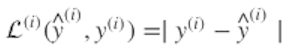
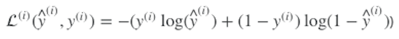
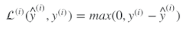
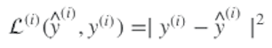
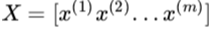
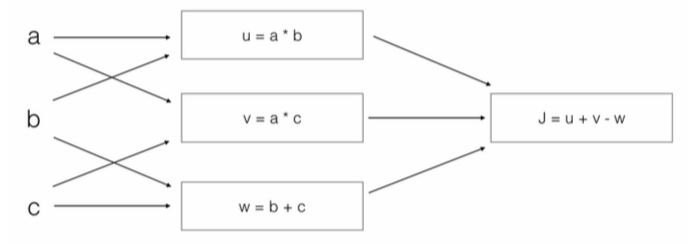

<h1 align="center">C1W2 神经网络编程基础</h1>

## 测验
___
> 1、神经元节点计算什么？
- [x] 神经元节点先计算线性函数（z = Wx + b），再计算激活函数。
    ```diff
        我们通常说神经元的输出是a=g（wx+b），其中g是激活功能（sigmoid，tanh，relu，…）
    ```
- [ ] 神经元节点先计算激活函数，再计算线性函数(z = Wx + b)。
- [ ] 神经元节点计算函数g，函数g计算(Wx + b)。
- [ ] 在将输出应用于激活函数之前，神经元节点计算所有特征的平均值。
___
> 2、下面哪一个是Logistic损失？
- [ ] 
- [x] 
    ```diff
        这便是课上讲到的逻辑损失函数
    ```
- [ ] 
- [ ] 
___
> 3、假设img是一个(32, 32, 3)数组，具有3个颜色通道：红色、绿色和蓝色的32x32像素的图像。 如何将其重新转换为列向量？
- [ ] x = img.reshape((3, 32 * 32))
- [ ] x = img.reshape((3, 32 * 32))
- [ ] x = img.reshape((32 * 32, 3))
- [x] x = img.reshape((32 * 32 * 3, 1))
___
> 4、看一下下面的这两个随机数组“a”和“b”

>       a = np.random.randn(2, 3) # a.shape = (2, 3)
>       b = np.random.randn(2, 1) # b.shape = (2, 1)
>       c = a + b
> 请问数组c的维度是多少？

- [ ] c.shape = (2, 1)
- [ ] c.shape = (3, 2)
- [ ] 无法进行计算，因为大小不匹配。将会报错。
- [x] c.shape = (2, 3)
    ```diff
        这便是广播机制。b（列向量）被复制3次，这样它的每一列就可以与a的每一列求和。
    ```

___
> 5、看一下下面的这两个随机数组“a”和“b”

>       a = np.random.randn(4, 3) # a.shape = (4, 3)
>       b = np.random.randn(3, 2) # b.shape = (3, 2)
>       c = a * b
> 请问数组c的维度是多少？
- [ ] c.shape = (4, 2)
- [ ] c.shape = (4, 3)
- [ ] c.shape = (3, 3)
- [x] 无法进行计算，因为大小不匹配。将会报错。
    ```diff
        numpy中的“*”运算符表示元素乘法。它不同于“np.dot（）”。如果你尝试“c=np.dot（a，b）”，你会得到c.shape=（4，2）。
    ```
___
> 6、假设你的每一个实例有n_x个输入特征，想一下在中，X的维度是多少？
- [ ] (1, m)
- [ ] (m, 1)
- [ ] (m, n_x)
- [x] (n_x, m)
___
> 7、回想一下，np.dot(a，b) 在a和b上执行矩阵乘法，而 a * b 执行元素方式的乘法。
> 看下面的这两个随机数组“a”和“b”：

>       a = np.random.randn(12288, 150) # a.shape = (12288, 150)
>       b = np.random.randn(150, 45) # b.shape = (150, 45)
>       c = np.dot(a, b)
> 请问c的维度是多少？
- [ ] c.shape = (150,150)
- [ ] c.shape = (12288, 150)
- [ ] 无法进行计算，因为大小不匹配。将会报错。
- [x] c.shape = (12288, 45)
    ```diff
        谨记np.dot（a，b）运算后的变量的shape为(a的行数, b的列数)。因为“a的列数=150=b的行数”，所以才能运算。
    ```
___

> 8、看下面的代码片段：

>       #  a.shape = (3,4)
>       #  b.shape = (4,1)
>       for i in range(3):
>           for j in range(4):
>               c[i][j] = a[i][j] + b[j]
> 请问要怎么把它们向量化？
- [ ] c = a.T + b.T
- [ ] c = a + b
- [x] c = a + b.T
- [ ] c = a.T + b
___
> 9、看下面的代码：

>       a = np.random.randn(3, 3)
>       b = np.random.randn(3, 1)
>       c = a * b
> 请问c的维度会是多少？
- [x] 这里将会使用广播机制，b会被复制三次，就会变成(3, 3)，“*”代表对应元素乘法。因此c.shape将是（3，3）
- [ ] 这里将会使用广播机制，b会被复制三次，就会变成(3, 3)，“*”代表两个3x3矩阵的矩阵乘法运算。因此c.shape将是（3，3）
- [ ] 这里将会使3x3矩阵A与3x1矢量相乘，从而产生3x1矢量。因此c.shape将是（3，1）。
- [ ] 这里将会报错，因为不能使用“*”对这两个矩阵进行操作。需要使用np.dot（a，b）。
___
> 10、看下面的计算图：

>

> 请问输出是什么？
- [ ] J = (c - 1) * (b + a)
- [x] J = (a - 1) * (b + c)
    ```diff
        J = u + v - w = a * b + a * c - (b + c) = a * (b + c) - (b + c) = (a - 1) * (b + c).
    ```
- [ ] J = a * b + b * c + a * c
- [ ] J = (b - 1) * (c + a)
___

