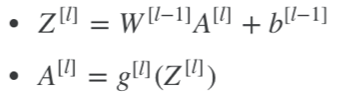

<h1 align="center">C1W3 浅层神经网络</h1>

## 测验
___
> 1、以下哪一项是正确的？
- [ ] X是一个矩阵，其中每个列都是一个训练示例。
- [ ]  是第二层第四层神经元的激活的输出。
- [ ] 表示第二层和第十二层的激活向量。
- [ ] 表示第二层的激活向量。
___
> 2、tanh激活函数通常比隐藏层单元的sigmoid激活函数效果更好，因为其输出的平均值更接近于零，因此它将数据集中在下一层是更好的选择，请问正确吗？
- [ ] 正确
- [ ] 错误
___
> 3、其中哪一个是第 l 层向前传播的正确向量化实现，其中1 ≤ l ≤ L
- [ ] A.

  
- [ ] B.

  
- [ ] C.

  
- [ ] D.

  
___
> 4、您正在构建一个识别黄瓜（y = 1）与西瓜（y = 0）的二元分类器。 你会推荐哪一种激活函数用于输出层？
- [ ] ReLU
- [ ] Leaky ReLU
- [ ] sigmoid
- [ ] tanh
___
> 5、看下面的代码：

>        A = np.random.randn(4,3)
>        B = np.sum(A, axis = 1, keepdims = True)
> 请问B.shape的值是多少?(可以打开python实验)
- [ ] (4,)
- [ ] (1, 3)
- [ ] (, 3)
- [ ] (4, 1)
___
> 6、假设你已经建立了一个神经网络。 您决定将权重和偏差初始化为零。 以下哪项陈述是正确的？
- [ ] 第一个隐藏层中的每个神经元节点将执行相同的计算。 所以即使经过多次梯度下降迭代后，层中的每个神经元节点都会计算出与其他神经元节点相同的东西。
- [ ] 第一个隐藏层中的每个神经元将在第一次迭代中执行相同的计算。 但经过一次梯度下降迭代后，他们将学会计算不同的东西，因为我们已经“破坏了对称性”。
- [ ] 第一个隐藏层中的每一个神经元都会计算出相同的东西，但是不同层的神经元会计算不同的东西，因此我们已经完成了“对称破坏”。
- [ ] 即使在第一次迭代中，第一个隐藏层的神经元也会执行不同的计算， 他们的参数将以自己的方式不断发展。
___
> 7、Logistic回归的权重w应该随机初始化，而不是全零，因为如果初始化为全零，那么逻辑回归将无法学习到有用的决策边界，因为它将无法“破坏对称性”，是正确的吗？
- [ ] 正确
- [ ] 错误
___

> 8、你已经为所有隐藏单元使用tanh激活建立了一个网络。 使用np.random.randn（..，..）* 1000 将权重初始化为相对较大的值。 会发生什么？
- [ ] 这没关系。只要随机初始化权重，梯度下降不受权重大小的影响。
- [ ] 这将导致tanh的输入也非常大，因此导致梯度也变大。因此，您必须将α设置得非常小以防止发散; 这会减慢学习速度。
- [ ] 这会导致tanh的输入也非常大，导致单位被“高度激活”，从而加快了学习速度，而权重必须从小数值开始。
- [ ] 这将导致tanh的输入也很大，因此导致梯度接近于零， 优化算法将因此变得缓慢。
___
> 9、看下面的单隐层神经网络 

- [ ] b[1] 的维度是 (4, 1)
- [ ] W[1] 的维度是 (4, 2)
- [ ] W[2] 的维度是 (1, 4)
- [ ] b[2] 的维度是 (1, 1)
___
> 10、在和上一个相同的网络中，Z[1] 和 A[1]的维度是多少？
- [ ] Z[1] 和 A[1] 的维度都是 (4, 1)
- [ ] Z[1] 和 A[1] 的维度都是 (1, 4)
- [ ] Z[1] 和 A[1] 的维度都是 (4, m)
- [ ] Z[1] 和 A[1] 的维度都是 (4, 2)
___

