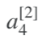
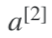
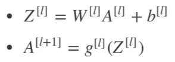

<h1 align="center">C1W3 浅层神经网络</h1>

## 测验
___
> 1、以下哪一项是正确的？
- [ ] 是第2个训练样本第12层的激活输出向量。
- [ ] X是一个矩阵，其中每一行都是一个训练样本。
- [ ]  是第4个训练样本第2层的激活输出值。
- [x]  是第2层第4个神经元的激活输出值。
- [x] 是第2层的激活向量。
- [x] 是第12个训练样本第2层的激活输出向量。
- [x] X是一个矩阵，其中每一列都是一个训练样本。
___
> 2、tanh激活函数通常比隐藏层单元的sigmoid激活函数效果更好，因为其输出的平均值更接近于零，因此它将数据集中，这对于下一层是更好的选择，请问正确吗？
- [x] 正确
    ```diff
        tanh的输出介于-1和1之间，因此它将数据集中起来，使下一层的学习更加简单。
    ```
- [ ] 错误
___
> 3、其中哪一个是第 l 层向前传播的正确向量化实现，其中1 ≤ l ≤ L
- [ ] A.

  
- [ ] B.

  
- [ ] C.

  
- [x] D.

  
___
> 4、你正在构建一个识别黄瓜（y = 1）与西瓜（y = 0）的二元分类器。 你会推荐哪一种激活函数用于输出层？
- [ ] ReLU
- [ ] Leaky ReLU
- [x] sigmoid
    ```diff
    sigmoid输出一个介于0和1之间的值，这使得它成为二进制分类的一个很好的选择。
    如果输出小于0.5，可以分类为0；如果输出大于0.5，可以分类为1。
    也可以用tanh来完成，但由于tanh输出介于-1和1之间，所以不太方便。
    ```
- [ ] tanh
___
> 5、看下面的代码：

>        A = np.random.randn(4,3)
>        B = np.sum(A, axis = 1, keepdims = True)
> 请问B.shape的值是多少?(可以打开python实验)
- [ ] (4,)
- [ ] (1, 3)
- [ ] (, 3)
- [x] (4, 1)
    ```diff
    我们使用（keepdims=true）来确保A.shape是（4,1）而不是（4，）。这使我们的代码更加严谨。
    ```
___
> 6、假设你已经建立了一个神经网络, 你决定将权重和偏差初始化为零。以下哪项陈述是正确的？
- [x] 第一个隐藏层中的每个神经元节点将执行相同的计算。 所以即使经过多次梯度下降迭代后，层中的每个神经元节点都会计算出与其他神经元节点相同的内容。
- [ ] 第一个隐藏层中的每个神经元将在第一次迭代中执行相同的计算。 但经过一次梯度下降迭代后，他们将学会计算不同的内容，因为我们已经“破坏了对称性”。
- [ ] 第一个隐藏层中的每一个神经元都会计算出相同的内容，但是不同层的神经元会计算不同的内容，因此我们已经完成了“对称破坏”。
- [ ] 即使在第一次迭代中，第一个隐藏层的神经元也会执行不同的计算， 他们的参数将以各自的方式不断发展。
___
> 7、Logistic回归的权重w应该随机初始化，而不是全零，因为如果初始化为全零，那么逻辑回归将无法学习到有用的决策边界，因为它将无法“破坏对称性”，是正确的吗？
- [ ] 正确
- [x] 错误
    ```diff
    逻辑回归没有隐藏层。如果将权重初始化为零，输入第一个样本x，模型将输出零。
    但逻辑回归的导数取决于输入x（因为没有隐藏层），并且输入x不是零。
    所以在第二次迭代中，权重W值遵循x的分布，并且如果x不是一个常数向量，那么它们(w1,w2,...)之间是不同的。
    ```
___

> 8、你已经为所有隐藏单元使用tanh激活建立了一个网络。 使用np.random.randn（..，..）* 1000 将权重初始化为相对较大的值。 会发生什么？
- [ ] 这将导致tanh的输入也非常大，因此导致梯度也变大。因此，你必须将α设置得非常小以防止发散; 这会减慢学习速度。
- [ ] 这会导致tanh的输入也非常大，导致单位被“高度激活”，从而加快了学习速度，而权重必须从小数值开始。
- [ ] 这没关系。只要随机初始化权重，梯度下降不受权重大小的影响。
- [x] 这将导致tanh的输入也很大，因此导致梯度接近于零， 优化算法将因此变得缓慢。   
    ```diff
    对于较大的值，tanh的图案变得平滑，将导致其梯度接近于零。这会减慢优化算法的速度。
    ```
___
> 9、看下面的单隐层神经网络 


- [ ] W[1] 的维度是 (2, 4)
- [x] b[1] 的维度是 (4, 1)
- [x] W[1] 的维度是 (4, 2)
- [ ] b[1] 的维度是 (2, 1)
- [x] W[2] 的维度是 (1, 4)
- [ ] b[2] 的维度是 (4, 1)
- [ ] W[2] 的维度是 (4, 1)
- [x] b[2] 的维度是 (1, 1)
___
> 10、在和上一个相同的网络中，Z[1] 和 A[1]的维度是多少？
- [ ] Z[1] 和 A[1] 的维度都是 (4, 1)
- [ ] Z[1] 和 A[1] 的维度都是 (1, 4)
- [x] Z[1] 和 A[1] 的维度都是 (4, m)
    ```diff
    m为样本数
    ```
- [ ] Z[1] 和 A[1] 的维度都是 (4, 2)
___

