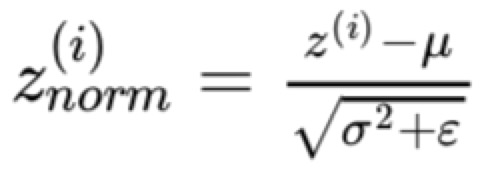

<h1 align="center">C2W3 超参数调整、批量标准化、编程框架</h1>

## 测验
___
> 1、如果在大量的超参数中搜索最佳的参数值，那么应该尝试在网格中搜索而不是使用随机值，以便更系统的搜索，而不是依靠运气，请问这句话是正确的吗？
- [ ] 正确
- [ ] 错误
___
> 2、每个超参数如果设置得不好，都会对训练产生巨大的负面影响，因此所有的超参数对于调优都同样重要，请问这是正确的吗？
- [ ] 正确
- [ ] 错误
___
> 3、在超参数搜索过程中，你尝试只照顾一个模型（使用熊猫策略）还是一起训练大量的模型（鱼子酱策略）在很大程度上取决于：
- [ ] 是否使用批量（batch）或小批量优化（mini-batch optimization）
- [ ] 神经网络中局部最小值（鞍点）的存在性
- [ ] 你能获得的计算力
- [ ] 需要调整的超参数的数量
___
> 4、如果您认为β（动量超参数）介于0.9和0.99之间，那么推荐采用以下哪一种方法来对β值进行取样？

- [ ] A.

        r = np.random.rand()
        beta = r*0.09 + 0.9
        
- [ ] B.

        r = np.random.rand()
        beta = 1-10**(- r - 1)
- [ ] C.

        r = np.random.rand()
        beta = 1-10**(- r + 1)
- [ ] D.

        r = np.random.rand()
        beta = r*0.9 + 0.09
  
___
> 5、找到好的超参数的值是非常耗时的，所以通常情况下你应该在项目开始时做一次，并尝试找到非常好的超参数，这样你就不必再次重新调整它们。请问这正确吗？
- [ ] 正确
- [ ] 错误
___
> 6、在视频中介绍的批量标准化中，如果将其应用于神经网络的第l层，那么需要标准化什么？
- [ ] b[l]
- [ ] a[l]
- [ ] z[l]
- [ ] W[l]
___
> 7、在标准化公式中，为什么要使用epsilon（ϵ）？

> 
- [ ] 加快收敛速度
- [ ] 避免除零操作
- [ ] 获得更精确的标准化
- [ ] 以防μ太小
___

> 8、批处理标准化中关于 γ 和 β 的以下哪些陈述是正确的？
- [ ] 每层有一个γ∈R的全局变量和一个β∈R的全局变量，并适用于该层中的所有隐藏单元。
- [ ] 它们可以在Adam、带有动量的梯度下降 或 RMSprop 使中用，而不仅仅是用梯度下降来学习。
- [ ] 最优值为γ=√（σ^2+ε），β=μ。
- [ ] β和γ是算法的超参数，我们通过随机抽样调整。
- [ ] 它们设定给定层的线性变量 z[l] 的均值和方差。
___
> 9、训练具有BN(批量标准化)的神经网络之后，测试时间，在新样本上评估神经网络时，你应该：
- [ ] 在训练期间，通过使用μ和σ^2的指数加权平均值估计mini-batches的情况，来执行所需的标准化。
- [ ] 跳过使用μ和σ^2的标准化步骤，因为单个测试样本无法标准化。
- [ ] 使用最新的小批量的μ和σ^2值, 来执行所需的标准化。
- [ ] 如果在256个示例的小批量上实现了批处理标准化，那么在一个测试样本上进行预测时，需要将该样本复制256次，使起拥有与训练时相同大小的小批量。
___
> 10、关于深度学习编程框架的这些陈述中，哪一个是正确的？
- [ ] 通过编程框架，您可以用比低级语言（如Python）更少的代码来编写深度学习算法。
- [ ] 即使一个项目目前是开源的，项目的良好管理有助于确保它即使在长期内仍然保持开放，而不是仅仅为了一个公司而关闭或修改。
- [ ] 深度学习编程框架的运行需要基于云的机器。
___