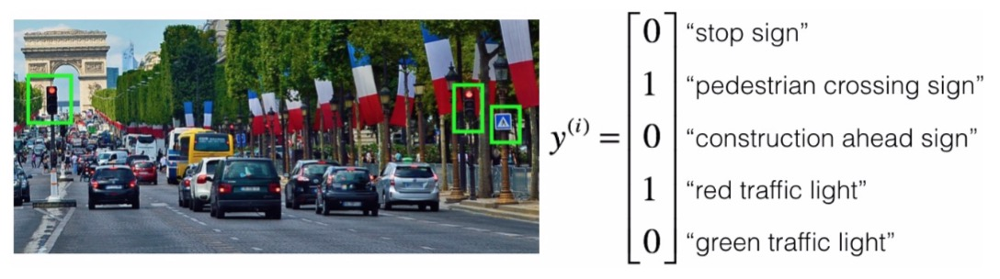
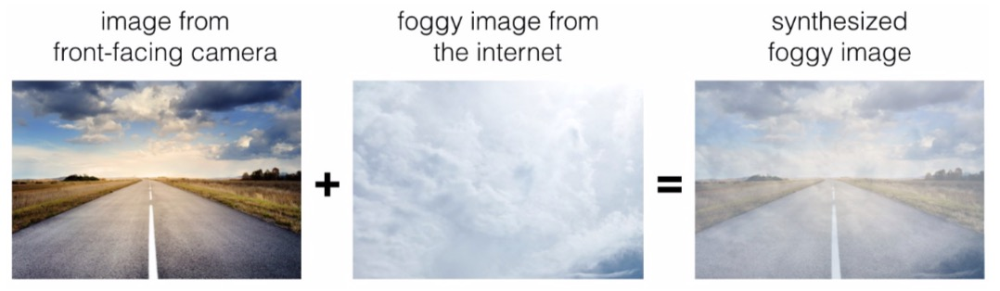

<h1 align="center">C3W2 自动驾驶（案例研究）</h1>

## 测验

> 1、为了帮助你练习机器学习策略，本周我们将介绍另一种场景并询问你将如何做。我们认为这个机器学习项目"模拟器"，可以帮助我们明确是什么在主导机器学习项目进展的。

> 你受雇于一家生产自动驾驶汽车的初创公司。你负责检测图片中的路标（停车标志，行人过路标志，前方施工标志）和交通信号标志（红灯和绿灯），目标是识别哪些对象出现在每个图片中。
例如，上面的图片包含一个行人过路标志和红色交通信号灯标志。 

> 有100,000张带标签的图片是使用你汽车的前置摄像头拍摄的。这也是你最关心的数据分布，你认为可以从互联网上获得更大的数据集，即使互联网数据的分布不相同，但也可能对训练有所帮助。

> 你刚刚开始着手这个项目，你该做的第一件事是什么？假设下面的每个步骤将花费大约相等的时间（大约几天）。
- [ ] 花几天的时间检测这些任务的人类表现，以便能够得到贝叶斯误差的准确估计。
- [ ] 花几天时间训练一个基本模型，看看它会犯什么错误。
- [ ] 花几天的时间使用汽车前置摄像头采集更多数据，以便更好地了解每单位时间可收集多少数据。
- [ ] 花几天时间去获取互联网的数据，这样你就能更好地了解哪些数据是可用的。
___
> 2、你的目标是检测图片中的道路标志（停车标志、行人过路标志、前方施工标志）和交通信号（红灯和绿灯），目标是识别这些对象中的哪一个出现在每个图像中。你计划使用一个深层的神经网络，在隐藏层中使用relu单元。

> 对于输出层，softmax对于输出层是一个很好的选择，因为这是一个多任务学习问题。对/错？
- [ ] 正确
- [ ] 错误
___
> 3、你正在做误差分析并计算错误率，在这些数据集中，你认为你应该手动仔细地检查哪些图片？
- [ ] 随机选择500图片
- [ ] 10,000张算法分类错误的图片
- [ ] 随机选择10,000图片
- [ ] 500张算法分类错误的图片
___
> 4.在处理了数据几周后，你的团队得到以下数据：
> * 100,000 张使用汽车前摄像头拍摄的标记了的图片
> * 900,000 张从互联网下载的标记了道路的图片
> * 每张图片的标签都精确地表示任何的特定路标和交通信号的组合

> 例如，y(i)= [1, 0, 0, 1, 0] 表示图片包含了停车标志和红色交通信号灯。

> 因为这是一个多任务学习问题，你需要让所有y(i)向量被完全标记。   
> 如果一个样本等于 y(i)= [0, 1, ?, ?, 1]，那么学习算法将无法使用该样本，是正确的吗？
- [ ] 正确
- [ ] 错误
___
> 5、你所关心的数据的分布包含了你汽车的前置摄像头的图片，这与你在网上找到并下载的图片不同。如何将数据集分割为训练/验证/测试集?
- [ ] 选择从互联网上的90万张图片和汽车前置摄像头的2万张图片作为训练集，剩余的8万张图片在验证集和测试集中平均分配。
- [ ] 将10万张前摄像头的图片与在网上找到的90万张图片随机混合，使得所有数据都随机分布。 将有100万张图片的数据集分割为：有60万张图片的训练集、有20万张图片的验证集和有20万张图片的测试集。
- [ ] 选择从互联网上的90万张图片和汽车前置摄像头的8万张图片作为训练集，剩余的2万张图片在验证集和测试集中平均分配。
- [ ] 将10万张前摄像头的图片与在网上找到的90万张图片随机混合，使得所有数据都随机分布。将有100万张图片的数据集分割为：有98万张图片的训练集、有1万张图片的验证集和有1万张图片的测试集。
___
> 6、你训练了一个系统，其误差度如下（误差度 = 100％ - 准确度）：

|数据集|图片数量|算法产生的错误|
|:------------:|:------------:|:------------:|
|训练集|随机抽取94万张图片（从90万张互联网图片 + 6万张汽车前摄像头拍摄的图片中抽取）|8.8%|
|训练-验证集|随机抽取2万张图片（从90万张互联网图片 + 6万张汽车前摄像头拍摄的图片中抽取）|9.1%|
|验证集|2万张汽车前摄像头拍摄的图片|14.3%|
|测试集|2万张汽车前摄像头拍摄的图片|14.8%|

> 你还知道道路标志和交通信号分类的人为错误率大约为0.5％。以下哪项是正确的（检查所有选项）?
- [ ] 你有很大的方差问题，因为你的模型不能很好地适应来自同一训练集上的分布的数据，即使是它从来没有见过的数据。
- [ ] 你有一个很大的数据不匹配问题，因为你的模型在训练-验证集上比在验证集上做得好得多。
- [ ] 你有一个很大的可避免偏差问题，因为你的训练集上的错误率比人为错误率高很多。
- [ ] 你有很大的方差的问题，因为你的训练集上的错误率比人类错误率要高得多。
- [ ] 由于验证集和测试集的错误率非常接近，所以你的算法过拟合了验证集。
___
> 7、根据上一个问题的表格，一位朋友认为 训练数据分布 比 验证/测试分布 的图片要容易识别得多。你怎么看？
- [ ] 你的朋友是对的。 （即训练数据分布的贝叶斯误差可能低于 验证/测试分布）。
- [ ] 你的朋友错了。（即训练数据分布的贝叶斯误差可能比 验证/测试分布 更高）。
- [ ] 没有足够的信息来判断你的朋友是对还是错。
- [ ] 无论你的朋友是对还是错，这些信息都对你没有用。
___

> 8、你决定将重点放在验证集上, 并手动检查是什么原因导致的错误。下面是一个表, 总结了你的发现:

|验证集总误差|14.3%|
|:------------:|:------------:|
|由于数据标记不正确而导致的错误|4.1%|
|由于雾天的图片引起的错误|8.0%|
|由于雨滴落在汽车前摄像头上造成的错误|2.2%|
|其他原因引起的错误|1.0%|
> 在这个表格中，4.1％、8.0％等误差的比例是总验证集（不仅仅是算法预测错误的样本）的一小部分，即大约 8.0 / 14.3 = 56％的错误是由于雾天的图片造成的。

> 从这个分析的结果意味着团队最先做的应该是把更多雾天的图片纳入训练集，以便解决该类别中的8%的错误，对吗？
- [ ] 是的，因为它是错误率最大的类别。正如视频中所讨论的，我们应该对错误率进行按大小排序，以避免浪费团队的时间。
- [ ] 是的，因为它比其他的错误类别错误率加在一起都大(8.0 > 4.1+2.2+1.0)。
- [ ] 错误，因为这取决于添加这些数据的容易程度以及你要考虑团队认为它会有多大帮助。
- [ ] 错误，因为数据增强(通过清晰的图像+雾的效果合成雾天的图像)更有效。
___
> 9、你可以买一个专门设计的雨刮，帮助擦掉正面相机上的一些雨滴。 根据上一个问题的表格，你同意以下哪些陈述？
- [ ] 对于挡风玻璃雨刷可以改善模型的性能而言，2.2％是改善的最大值。
- [ ] 对于挡风玻璃雨刷可以改善模型的性能而言，2.2％是改善最小值。
- [ ] 对于挡风玻璃雨刷可以改善模型的性能而言，改善的性能就是2.2％。
- [ ] 在最坏的情况下，2.2%将是一个合理的估计，因为挡风玻璃刮水器会损坏模型的性能。
___
> 10、你决定使用数据增强来解决雾天的图像，你可以在互联网上找到1,000张雾的照片，然后拿清晰的图片和雾来合成雾天图片，如下所示：

> 你同意下列哪种说法？（检查所有选项）
- [ ] 只要合成的雾对人眼来说是真实的，你就可以确信合成的数据和真实的雾天图像差不多，因为人类视觉的精准性有助于你正在解决的问题。
- [ ] 只要将1000张雾图与更多的（>>1000）干净/无雾图像组合，就不会有过匹配的风险。
- [ ] 在训练数据集中添加，看上去像是从汽车正面摄像头拍摄的真实雾状照片的合成图像，不会帮助模型改进，因为它会引入可避免的偏差。
___
> 11、在进一步处理问题之后，你已决定更正验证集上错误标记的数据。 你同意以下哪些陈述？ （检查所有选项）。
- [ ] 你还应该更正测试集中错误标记的数据，使验证和测试集来自同一分布。
- [ ] 你应该更正训练集中的错误标记数据, 以免你现在的训练集与验证集更不同。
- [ ] 你不应该更正测试集中错误标记的数据，使验证和测试集来自同一分布。
- [ ] 你不应更正训练集中的错误标记的数据, 以免现在的训练集与验证集更不同。 

___
> 12、到目前为止，你的算法仅能识别红色和绿色交通灯，该公司的一位同事开始着手识别黄色交通灯（一些国家称之为橙色光而不是黄色光，我们将使用美国的黄色标准），含有黄色灯的图像非常罕见，而且她没有足够的数据来建立一个好的模型，她希望你能利用迁移学习帮助她。

> 你将告诉你同事什么？
- [ ] 她应该尝试使用在你的数据集上预先训练过的权重，并用黄光数据集进行进一步的微调。
- [ ] 如果她有10,000个黄光图像，从你的数据集中随机抽取10,000张图像，并将你和她的数据放在一起，这可以防止你的数据集“淹没”她的黄灯数据集。
- [ ] 你没办法帮助她，因为你的数据分布与她的不同，而且缺乏黄灯标签的数据。
- [ ] 建议她尝试多任务学习，而不是使用所有数据进行迁移学习。
___
> 13、另一位同事想要使用放置在车外的麦克风来更好地听清你周围是否有其他车辆。 例如，如果你身后有警车，你就可以听到警笛声。 但是，他们没有太多的训练这个音频系统，你能帮忙吗？

- [ ] 从视觉数据集迁移学习可以帮助你的同事加速进展，多任务学习似乎不太有希望。
- [ ] 从你的视觉数据集中进行多任务学习可以帮助你的同事加速进展，迁移学习似乎不太有希望。
- [ ] 迁移学习或多任务学习都可以帮助我们的同事加速进展。
- [ ] 迁移学习和多任务学习都不是很有希望。
___
> 14、为了识别红灯和绿灯，你一直在使用这种方法
> * (A): 将图像(x)输入到神经网络，并直接学习映射以预测是否存在红光和/或绿光(y)。

> 一个队友提出了另一种两步走的方法：
> * (B)：在这个两步法中，你首先要检测图像中的交通灯（如果有），然后确定交通信号灯中照明灯的颜色。

> 在这两者之间，方法B更多的是端到端的方法，因为它在输入端和输出端有不同的步骤，这种说法正确吗？
- [ ] 正确
- [ ] 错误
___
> 15、如果你有一个____,在上面的问题中方法A往往比B方法更有效，

> 你同意下面哪些说法？（检查所有选项。）
- [ ] 大训练集
- [ ] 多任务学习的问题
- [ ] 偏差比较大的问题
- [ ] 高贝叶斯误差的问题
___