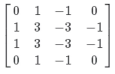
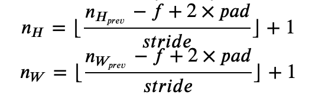

<h1 align="center">C4W1 卷积神经网络的基本知识</h1>

## 测验

> 1、你认为把下面这个过滤器应用到灰度图像会怎么样？ 


- [ ] 会检测图像对比度
- [ ] 会检测45度边缘
- [x] 会检测垂直边缘
    ```diff
    因为左边的部分是正的，右边的部分是负的。
    ```
- [ ] 会检测水平边缘
___
> 2、假设你的输入是一个300×300的彩色（RGB）图像，而你没有使用卷积神经网络。 如果第一个隐藏层有100个神经元，每个神经元与输入层进行全连接，那么这个隐藏层有多少个参数（包括偏置参数）？
- [ ] 9,000,001
- [ ] 9,000,100
- [ ] 27,000,001
- [x] 27,000,100
    ```diff
    100 * 300 * 300 * 3 + 100 = 27,000,100
    ```
___
> 3、假设你的输入是300×300彩色（RGB）图像，并且你使用卷积层和100个过滤器，每个过滤器都是5×5的大小，请问这个隐藏层有多少个参数（包括偏置参数）？
- [ ] 2501
- [ ] 2600
- [ ] 7500
- [x] 7600
    ```diff
    因为是RGB图片，故过滤器的shape为(5, 5, 3)
    每个过滤器对应一个偏置b, 则一个完整的过滤器参数个数为：5 * 5 * 3 + 1 = 76 
    则100个过滤器的参数个数为：76 * 100 = 7600
    ```
___
> 4、你有一个63x63x16的输入，并使用大小为7x7的32个过滤器进行卷积，使用步幅为2和无填充，请问输出是多少？

- [x] 29x29x32

    
    
    ```diff
    代入公式，可得：
    nx = nw = (63 - 7 + 2 * 0)/2 + 1 = 29
    又因为有32个过滤器，故输出尺寸为: (29, 29, 32)
    ```
    
- [ ] 16x16x16     
- [ ] 16x16x32
- [ ] 29x29x16
___
> 5、你有一个15x15x8的输入，并使用“pad = 2”进行填充，填充后的尺寸是多少？
- [ ] 17x17x10
- [x] 19x19x8
- [ ] 19x19x12
- [ ] 17x17x8
___
> 6、你有一个63x63x16的输入，有32个过滤器进行卷积，每个过滤器的大小为7x7，步幅为1，你想要使用“same”的卷积方式，请问pad的值是多少？
- [ ] 1
- [ ] 2
- [x] 3

    
    
    ```diff
    “same”的卷积方式表示卷积前后尺寸大小不变
    由公式可得 p = (s * n - n - s + f)/2 = (1 * 63 - 63 - 1 + 7)/2 = 6/2 = 3 
    ```

- [ ] 7
___
> 7、你有一个32x32x16的输入，并使用步幅为2、过滤器大小为2的最大化池，请问输出是多少？
- [x] 16x16x16
- [ ] 32x32x8
- [ ] 15x15x16
- [ ] 16x16x8
___
> 8、因为池化层不具有参数，所以它们不影响反向传播的计算。
- [ ] 正确
- [x] 错误
___
> 9、在视频中，我们谈到了“参数共享”是使用卷积网络的好处。关于参数共享的下列哪个陈述是正确的？（检查所有选项。）
- [x] 它减少了参数的总数，从而减少过拟合。
- [ ] 它允许为一项任务学习而来的参数，即使针对不同的任务也可以共享（迁移学习）。
- [ ] 它允许梯度下降将许多参数设置为零，从而使得连接变得稀疏。
- [x] 它允许在整个输入图片或输入三维特征图的多个位置使用特征检测器。
___
> 10、在课堂上，我们讨论了“稀疏连接”是使用卷积层的好处。这是什么意思?
- [ ] 正则化导致梯度下降将许多参数设置为零
- [ ] 卷积网络中的每一层只连接到另外两层
- [x] 下一层中的每个激活只依赖于前一层的少量激活
- [ ] 每个过滤器都连接到上一层的每个通道
___