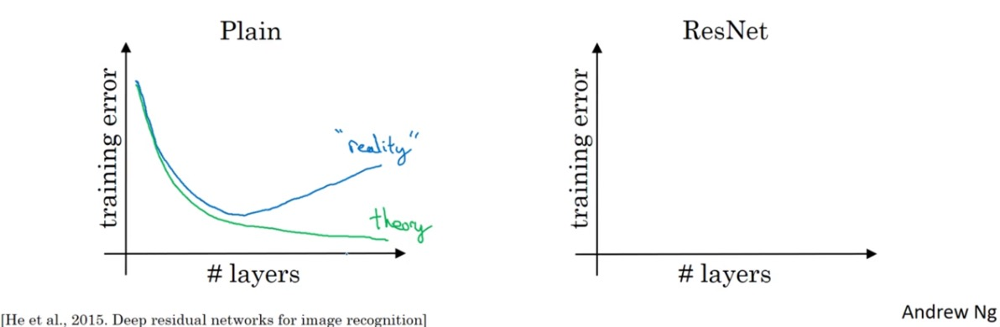
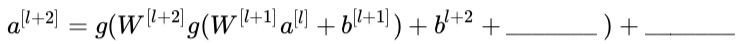

<h1 align="center">C4W2 深度卷积网络模型</h1>

## 测验

> 1、在典型的卷积神经网络中，随着网络深度增加，你能看到的现象是？

> 备注：n[h]和n[w]是特征图的高度和宽度，n[c]是特征图的通道数。
- [ ] n[h] 和 n[w] 减少，同时n[c] 减少。
- [ ] n[h] 和 n[w] 增加，同时n[c] 增加。
- [ ] n[h] 和 n[w] 增加，同时n[c] 减少。
- [x] n[h] 和 n[w] 减少，同时n[c] 增加。
___
> 2、在典型的卷积神经网络中，你能看到的是？
- [x] 多个卷积层后面跟着的是一个池化层。
- [ ] 多个池化层后面跟着的是一个卷积层。
- [x] 全连接层位于最后的几层。
- [ ] 全连接层位于开始的几层。
___
> 3、为了构建一个非常深的网络，我们经常在卷积层使用“valid”填充，只使用池化层来缩小激活值的宽/高度，否则的话就会使得输入迅速的变小
- [ ] True
- [x] False
___
> 4、我们使用普通的网络结构来训练一个很深的网络，要使得网络适应一个很复杂的功能（比如增加层数)，总会有更低的训练误差。

- [ ] True
- [x] False
    ```diff
    理论上，随着网络的加深，普通网络的训练误差应越来越少，但实际上却是先减后增；
    而ResNet网络可以改善这个缺点。
    ```
    
___
> 5、下面计算残差(ResNet)块的公式中，横线上应该分别填什么？ 

- [ ] 分别是 0 与 a[l] 。
- [ ] 分别是 z[l] 与 a[l] 。
- [ ] 分别是 0 与 z[l+1] 。
- [x] 分别是 a[l] 与 0 。
    ```diff
    a[l+2] = g(z[l+2] + a[l])
           = g(W[l+2]a[l+1] + b[l+2] + a[l])
           = g(W[l+2]g(z[l+1]) + b[l+2] + a[l])
           = g(W[l+2]g(W[l+1]a[l] + b[l+1]) + b[l+2] + a[l])
    ```
___
> 6、关于残差网络下面哪个（些）说法是正确的？
- [x] 使用跳越连接能够对反向传播的梯度下降有益，且能够帮你对更深的网络进行训练。
- [x] 跳跃连接能够使得网络轻松地学习残差块中输入输出之间的恒等映射。
- [ ] 有L层的残差网络一共有L^2种跳跃连接的顺序。
- [ ] 跳跃连接用一个复杂的非线性函数去计算输入在网络深层中的传递关系。
___
> 7、假设你的输入的维度为64x64x16，单个1x1的卷积过滤器含有多少个参数（包括偏差）？
- [ ] 2
- [ ] 1
- [ ] 4097
- [x] 17
___
> 8、假设你有一个维度为n[h]×n[w]×n[c]的卷积输入，下面哪个说法是正确的（假设卷积层为1x1，步伐为1，padding为0）？
- [x] 你可以使用池化层减少 n[h]、n[w]，但是不能减少 n[c]
- [ ] 你可以使用池化层减少 n[h]、 n[w]和n[c]
- [ ] 你可以使用一个1x1的卷积层来减少n[h]、n[w]和n[c]
- [x] 你能够使用1x1的卷积层来减少n[c]，但是不能减少 n[h]、n[w]
___
> 9、关于 Inception 网络下面哪些说法是正确的
- [x] 一个 Inception 块允许网络使用1x1, 3x3, 5x5 的组合来实现卷积和池化。
- [x] Inception 块通常使用1x1的卷积来减少输入特征图的大小，然后再使用3x3和5x5的卷积。
- [ ] Inception 网络包含了各种网络的体系结构（类似于随机删除节点模式，它会在每一步中随机选择网络的结构），因此它具有随机删除节点的正则化效应。
- [ ] 通过叠加 Inception 块的方式让 Inception 网络更深不会损害训练集的表现。
___
> 10、下面哪些是使用卷积网络的开源实现（包含模型/权值）的常见原因？
- [ ] 通过一个计算机视觉任务训练而来的模型通常可以用来作数据扩充，即使对于不同的计算机视觉任务也是如此。
- [ ] 赢得计算机视觉比赛的技术(如在测试时使用多个multiple crops)，被广泛使用在卷积网络相关的实际部署（或生产系统部署）中。
- [x] 通过一个计算机视觉任务训练而来的参数通常对其他计算机视觉任务的预训练是有帮助的。
- [x] 这是一种快捷方法去实现一个复杂的卷积网络结构。
___