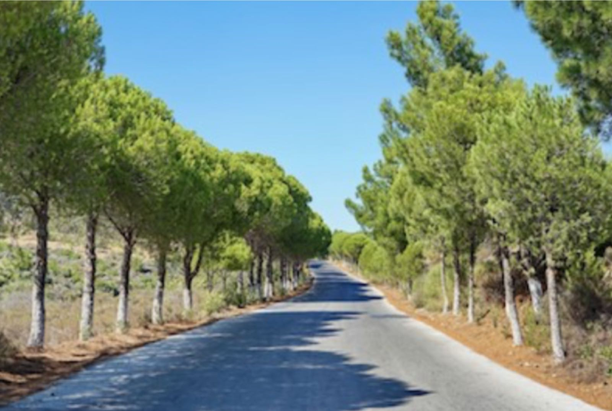
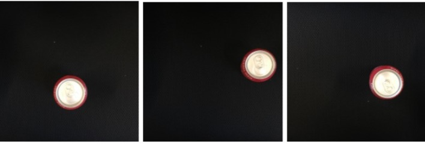
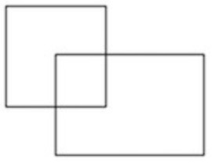
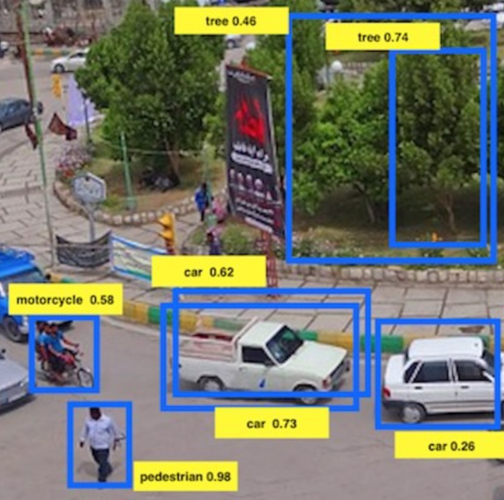

<h1 align="center">C4W3 目标检测算法</h1>

## 测验

> 1、现在你要构建一个能够识别三个对象并定位位置的算法，这些对象分别是：行人（c=1），汽车（c=2），摩托车（c=3）。 下图对应的标签哪个是正确的？

> 注：y=[p_c, b_x, b_y, b_h, b_w, c1, c2, c3]  

- [x] y=[1, 0.3, 0.7, 0.3, 0.3, 0, 1, 0]
- [ ] y=[1, 0.7, 0.5, 0.3, 0.3, 0, 1, 0]
- [ ] y=[1, 0.3, 0.7, 0.5, 0.5, 0, 1, 0]
- [ ] y=[1, 0.3, 0.7, 0.5, 0.5, 1, 0, 0]
- [ ] y=[0, 0.2, 0.4, 0.5, 0.5, 0, 1, 0]
___
> 2、继续上一个问题，下图中y的值是多少？注：“？”是指“不关心这个值”，这意味着神经网络的损失函数不会关心神经网络对输出的结果，和上面一样，y=[p_c, b_x, b_y, b_h, b_w, c1, c2, c3]。 

- [ ] y=[1, ?, ?, ?, ?, 0, 0, 0]
- [x] y=[0, ?, ?, ?, ?, ?, ?, ?]
- [ ] y=[?, ?, ?, ?, ?, ?, ?, ?]
- [ ] y=[0, ?, ?, ?, ?, 0, 0, 0]
- [ ] y=[1, ?, ?, ?, ?, ?, ?, ?]
___
> 3、你现在任职于自动化工厂中，你的系统会看到一罐饮料从传送带上下来，你想要对其进行拍照，
然后确定照片中是否有饮料罐，如果有的话就对其进行包装。饮料罐头是圆的，而包装盒是方的，
每一罐饮料的大小是一样的，每个图像中最多只有一罐饮料，现在你有下面的方案可供选择，这里有一些训练集图像： 

- [ ] Logistic unit (用于分类图像中是否有罐头)
- [x] Logistic unit,b_x 和 b_y
- [ ] Logistic unit,b_x,b_y,b_h (因为b_w =b_h，所以只需要一个就行了)
- [ ] Logistic unit,b_x,b_y,b_h,b_w
___
> 4、如果你想要构建一个能够输入人脸图片，输出N个人脸关键点的神经网络（假设图像只包含一张脸），那么你的神经网络有多少个输出节点？

- [ ] N
- [x] 2N
- [ ] 3N
- [ ] N^2
___
> 5、当你训练一个视频中描述的对象检测系统时，里需要一个包含了检测对象的许多图片的训练集，然而边界框不需要在训练集中提供，因为算法可以自己学习检测对象，这个说法对吗？ 
- [ ] 正确
- [x] 错误
___
> 6、假如你正在应用一个滑动窗口分类器（非卷积实现），增加步伐不仅会提高准确性，也会降低成本。
- [ ] 正确
- [x] 错误
___
> 7、在YOLO算法训练的时候，只有一个包含对象的中心/中点的一个单元负责检测这个对象。
- [x] 正确
- [ ] 错误
___
> 8、这两个框中IoU大小是多少？左上角的框是2x2大小，右下角的框是2x3大小，重叠部分是1x1。 

- [ ] 1/6
- [x] 1/9
- [ ] 1/10
- [ ] 以上都不是
    ```diff
    1 * 1 / (2 * 2 + 2 * 3 − 1 * 1) = 1/9
    ```
___
> 9、假如你在下图中的预测框中使用非最大值抑制，其参数是放弃概率≤ 0.4的框，并决定两个框IoU的阈值为0.5，使用非最大值抑制后会保留多少个预测框？ 

- [ ] 3
- [ ] 4
- [x] 5
- [ ] 6
- [ ] 7
___
> 10、假如你使用YOLO算法，使用19x19格子来检测20个分类，使用5个锚框（anchor box）。
在训练的过程中，对于每个图像你需要输出卷积后的结果y作为神经网络目标值（这是最后一层），y可能包括一些“？”或者“不关心的值”。请问最后的输出维度是多少？
- [ ] 19x19x(25x20)
- [ ] 19x19x(5x20)
- [ ] 19x19x(20x25)
- [x] 19x19x(5x25)
___