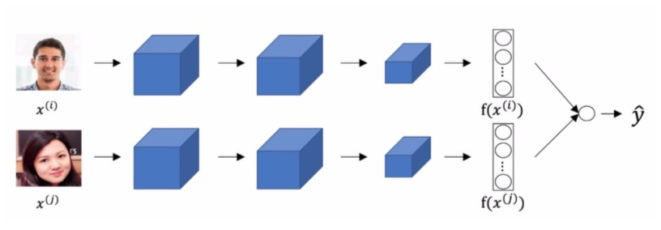

<h1 align="center">C4W4 人脸识别和神经风格迁移</h1>

## 测验

> 1、面部验证只需要将新图片与1个人的面部进行比较，而面部识别则需要将新图片与K个人的面部进行比较。
- [ ] 正确
- [ ] 错误
___
> 2、在人脸验证中函数d(img1,img2)起什么作用？
- [ ] 只需要给出一个人的图片就可以让网络认识这个人。
- [ ] 为了解决一次学习的问题。
- [ ] 这可以让我们使用softmax函数来学习预测一个人的身份，在这个单元中分类的数量等于数据库中的人的数量加1。
- [ ] 鉴于我们拥有的照片很少，我们需要将它运用到迁移学习中。
___
> 3、为了训练人脸识别系统的参数，使用包含了10万个不同的人的10万张图片的数据集进行训练是合理的。
- [ ] 正确
- [ ] 错误
___
> 4、下面哪个是三元组损失的正确定义（把α也考虑进去）？

- [ ] max( || f(A) − f(P) ||^2 − || f(A) − f(N) ||^2 + α, 0 )
- [ ] max( || f(A) − f(N) ||^2 − || f(A) − f(P) ||^2 + α, 0 )
- [ ] max( || f(A) − f(N) ||^2 − || f(A) − f(P) ||^2 - α, 0 )
- [ ] max( || f(A) − f(P) ||^2 − || f(A) − f(N) ||^2 - α, 0 )

___
> 5、在下图中的孪生卷积网络(Siamese network)结构图中，上下两个神经网络拥有不同的输入图像，但是其中的网络参数是完全相同的。 

- [ ] 正确
- [ ] 错误
___
> 6、你在一个拥有100种不同的分类的数据集上训练一个卷积神经网络，你想要知道是否能够找到一个对猫的图片很敏感的隐藏节点（即在能够强烈激活该节点的图像大多数都是猫的图片的节点），你更有可能在第4层找到该节点而不是在第1层更有可能找到。
- [ ] 正确
- [ ] 错误
___
> 7、神经风格转换被训练为有监督的学习任务，其中的目标是输入两个图像 (x)，并训练一个能够输出一个新的合成图像(y)的网络。
- [ ] 正确
- [ ] 错误
___
> 8、在一个卷积网络的深层，每个通道对应一个不同的特征检测器，风格矩阵G[l]度量了l层中不同的特征探测器的激活（或相关）程度。  
- [ ] 正确
- [ ] 错误
___
> 9、在神经风格转换中，在优化算法的每次迭代中更新的是什么？
- [ ] 生成图像G的像素值
- [ ] 神经网络的参数
- [ ] 内容图像C的像素值
- [ ] 正则化参数
___
> 10、你现在用拥有的是3D的数据，现在构建一个网络层，其输入的卷积是32×32×32×16（此卷积有16个通道），对其使用32个3×3×3的过滤器（无填充，步伐为1）进行卷积操作，请问输出的卷积是多少？
- [ ] 不能操作，因为指定的维度不匹配，所以这个卷积步骤是不可能执行的。
- [ ] 30×30×30×16
- [ ] 30×30×30×32
___