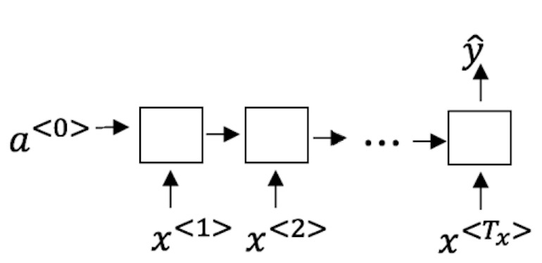
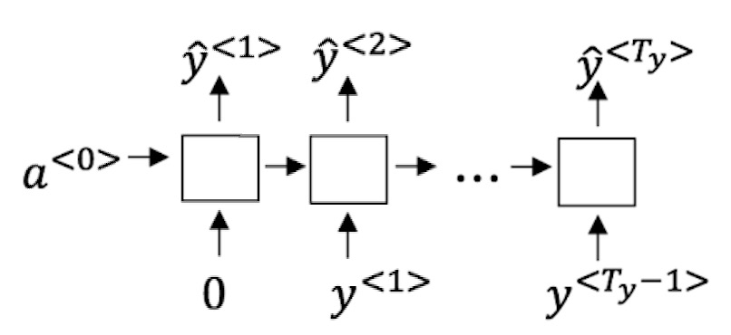
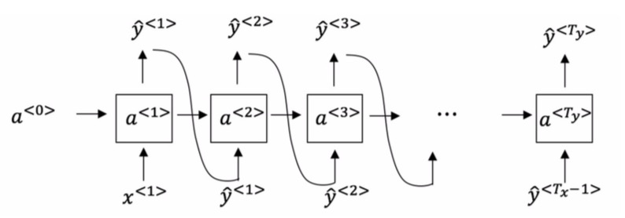
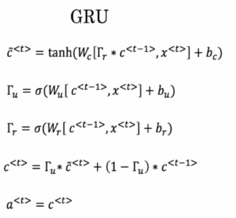
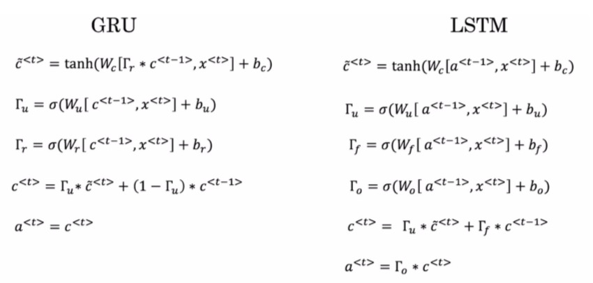

<h1 align="center">C5W1 循环神经网络</h1>

## 测验

> 1、假设你的训练样本是句子(单词序列)，下面哪个选项指的是第i个训练样本中的第j个词?
- [x] x(i)< j> 
    ```diff
    我们首先对第i行进行索引，得到第i个训练示例（用括号表示），然后对j列进行索引，得到第j个单词（用尖括号表示）。
    ```
- [ ] x< i>(j)
- [ ] x(j)< i>
- [ ] x< j>(i)

___
> 2、看一下下面的这个循环神经网络：  

>在下面的条件中，满足上图中的网络结构的参数是：

- [x] T_x = T_y
- [ ] T_x < T_y
- [ ] T_x > T_y
- [ ] T_x = 1
___
> 3、这些任务中的哪一个会使用多对一的RNN体系结构？ 

- [ ] 语音识别（输入语音，输出文本）。
- [x] 情感分类（输入一段文字，输出0或1表示正面或者负面的情绪）。
- [ ] 图像分类（输入一张图片，输出对应的标签）。
- [x] 人声性别识别（输入语音，输出说话人的性别）。
___
> 4、假设你现在正在训练下面这个RNN的语言模型： 

> 在t时刻，这个RNN在做什么？

- [ ] 计算 P(y<1>,y<2>,…,y<t−1>)
- [ ] 计算 P(y<t>)
- [x] 计算 P(y< t > ∣ y<1>,y<2>,…,y<t−1>)
    ```diff
    在这个语言模型中，我们试图根据之前所有步骤信息来预测下一步。
    ```
- [ ] 计算 P(y< t > ∣ y<1>,y<2>,…,y< t >)

___
> 5、你已经完成了一个语言模型RNN的训练，并用它来对句子进行随机取样，如下图：

> 在每个时间步t都在做什么？ 
- [ ] (1)使用由RNN输出的概率来选择该时间步的最高概率词作为 ŷ < t>，(2) 然后将训练集中的实际单词传递到下一个时间步。
- [ ] (1)使用由RNN输出的概率来随机抽取该时间步的所选单词作为 ŷ < t> ，(2)然后将训练集中的实际单词传递到下一个时间步。
- [ ] (1)使用由RNN输出的概率来选择该时间步的最高概率词作为 ŷ < t>，(2)然后将该选定单词传递给下一个时间步。
- [x] (1)使用由RNN输出的概率来随机抽取该时间步的所选单词作为ŷ < t> ，(2)然后将该选定单词传递给下一个时间步。
___
> 6、你正在训练一个RNN网络，你发现你的权重与激活值都是“NaN”，下列选项中，哪一个是导致这个问题的最有可能的原因？
- [ ] 梯度消失。
- [x] 梯度爆炸。
- [ ] ReLU函数作为激活函数g(.)，在计算g(z)时，z的数值过大了。
- [ ] Sigmoid函数作为激活函数g(.)，在计算g(z)时，z的数值过大了。
___
> 7、假设你正在训练一个 LSTM 网络，你有一个10,000词的词汇表，并且使用一个激活值维度为100的 LSTM 块，在每一个时间步中，Γ_u的维度是多少？
- [ ] 1
- [x] 100
- [ ] 300
- [ ] 10000
    ```diff
    Γ_u的向量维度等于LSTM中隐藏单元的数量。
    ```
___
> 8、这里有一些GRU的更新方程：  


> Alice建议通过移除 Γ_u来简化GRU，即设置Γ_u＝1。Betty提出通过移除 Γ_r来简化GRU，即设置 Γ_r＝1。哪种模型更容易在梯度不消失问题的情况下训练，即使在很长的输入序列上也可以进行训练？
- [ ] Alice的模型（即移除Γ_u），因为对于一个时间步而言，如果Γ_r≈0，梯度可以通过时间步反向传播而不会衰减。
- [ ] Alice的模型（即移除Γ_u），因为对于一个时间步而言，如果Γ_r≈1，梯度可以通过时间步反向传播而不会衰减。
- [x] Betty的模型（即移除Γ_r），因为对于一个时间步而言，如果Γ_u≈0，梯度可以通过时间步反向传播而不会衰减。
- [ ] Betty的模型（即移除Γ_r），因为对于一个时间步而言，如果Γ_u≈1，梯度可以通过时间步反向传播而不会衰减。
    ```diff
    要使信号反向传播而不消失，我们需要 c<t> 高度依赖于 c<t−1> 
    ```
___
> 9、这里有一些GRU和LSTM的方程: 


> 从这些我们可以看到，在LSTM中的更新门和遗忘门在GRU中扮演类似 _____ 与 _____ 的角色，空白处应该填什么？
- [x] Γ_u 与 1 − Γ_u
- [ ] Γ_u 与 Γ_r
- [ ] 1 − Γ_u 与 Γ_u
- [ ] Γ_r 与 Γ_u
___
> 10、你有一只宠物狗，它的心情很大程度上取决于当前和过去几天的天气。你已经收集了过去365天的天气数据x<1>,…,x<365>x<1>,…,x<365>，这些数据是一个序列，你还收集了你的狗心情的数据y<1>,…,y<365>y<1>,…,y<365>，你想建立一个模型来从x到y进行映射，你应该使用单向RNN还是双向RNN来解决这个问题？

- [ ] 双向RNN，因为在第 t 天的情绪预测中可以考虑到更多的信息。
- [ ] 双向RNN，因为这允许反向传播计算中有更精确的梯度。
- [x] 单向RNN，因为y< t >的值仅依赖于x<1>,…,x< t >，而不依赖于x<t+1>,…,x<365>。
- [ ] 单向RNN，因为y< t >的值只取决于x< t >，而不是其他天的天气。
___