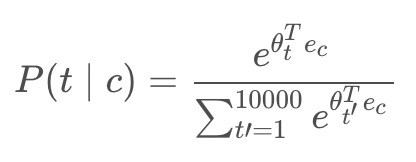
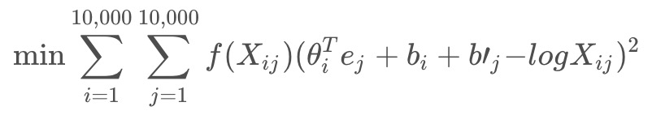

<h1 align="center">C5W2 自然语言处理与词嵌入</h1>

## 测验

> 1、假设你为10000个单词学习词嵌入，为了捕获全部范围的单词的变化以及意义，那么词嵌入向量应该是10000维的。
- [ ] 正确
- [x] 错误
___
> 2、什么是t-SNE？
- [ ] 一种能够解决词向量上的类比的线性变换。
- [x] 一种非线性降维算法。
- [ ] 一种用于学习词嵌入的监督学习算法。
- [ ] 一个开源序列模型库。
___
> 3、假设你下载了一个已经在一个很大的文本语料库上训练过的词嵌入的数据，然后你要用这个词嵌入来训练RNN并用于识别一段文字中的情感，判断这段文字的内容是否表达了“快乐”。

|x(输入文本)|y (是否快乐)|
|:------------:|:------------:|
|我今天感觉很好!|1|
|我觉得很沮丧，因为我的猫生病了。|0|
|真的很享受这个！|1|

> 那么即使“欣喜若狂”这个词没有出现在你的小训练集中，你的RNN也会认为“我欣喜若狂”应该被贴上 y = 1 的标签。
- [x] 正确
- [ ] 错误
___
> 4、对于词嵌入而言，下面哪一个（些）方程是成立的？ 

- [x] e_boy − e_girl ≈ e_brother − e_sister
- [ ] e_boy − e_girl ≈ e_sister − e_brother  
- [x] e_boy − e_brother ≈ e_girl − e_sister  
- [ ] e_boy − e_brother ≈ e_sister − e_girl  
___
> 5、设EE为嵌入矩阵，e_1234对应的是词“1234”的独热向量，为了获得1234的词嵌入，为什么不直接在Python中使用代码 E * e_1234 呢？

- [x] 因为这个操作是在浪费计算资源。
- [ ] 因为正确的计算方式是 E^T * e_1234 
- [ ] 因为它没有办法处理未知的单词（<UNK>）。
- [ ] 以上全都不对，因为直接调用 E * e_1234 是最好的方案。
___
> 6、在学习词嵌入时，我们创建了一个预测 P(target∣context) 的任务，如果这个预测做的不是很好那也是没有关系的，因为这个任务更重要的是学习了一组有用的嵌入词。
- [ ] 正确
- [x] 错误
___
> 7、在word2vec算法中，你要预测P(t∣c)，其中 t 是目标词（target word），c 是语境词（context word）。你应当在训练集中怎样选择 t 与 c 呢？
- [x] c 与 t 应当在附近词中。
- [ ] c 是 t 之前句子中所有单词的序列。
- [ ] c 是 t 之前句子中几个单词的序列。
- [ ] c 是在 t 前面的一个词。
___
> 8、假设你有1000个单词词汇，并且正在学习500维的词嵌入，word2vec模型使用下面的softmax函数： 

> 以下说法中哪一个（些）是正确的？
- [x] θ_t 与 e_c 都是500维的向量。
- [ ] θ_t 与 e_c 都是10000维的向量。
- [x] θ_t 与 e_c 都是通过Adam或梯度下降等优化算法进行训练的。
- [ ] 训练之后，θ_t 应该非常接近 e_c，因为 t 和 c 是一个词。
___
> 9、这里有一些GRU和LSTM的方程: 

> 以下说法中哪一个（些）是正确的？
- [ ] θ_i 与 e_j 应当初始化为0。
- [x] θ_i 与 e_j 应当使用随机数进行初始化。
- [x] X_ij 是单词 i 在 j 中出现的次数。
- [x] 加权函数 f(.) 必须满足 f(0)=0 。
___
> 10、你已经在文本数据集 m1 上训练了词嵌入，现在准备将它用于一个语言任务中，对于这个任务，你有一个单独标记的数据集 m2，请记住，使用词嵌入是一种迁移学习的形式，在这种情况下，你认为词嵌入会有帮助吗？

- [x] m1 >> m2
- [ ] m1 << m2
___