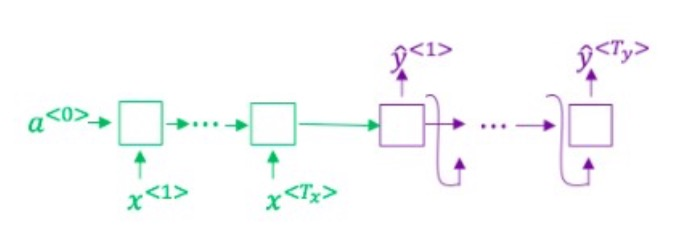
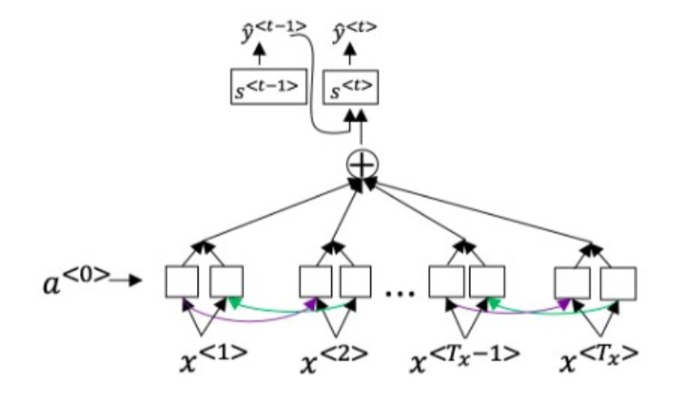
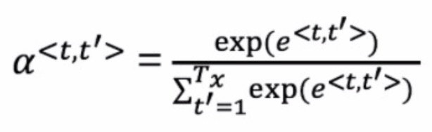
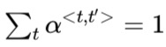
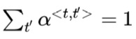

<h1 align="center">C5W3 序列模型与注意力机制</h1>

## 测验

> 1、想一想使用如下的编码-解码模型来进行机器翻译：

> 这个模型是“条件语言模型”,编码器部分(绿色显示)的意义是建模中输入句子x的概率
- [ ] 正确
- [ ] 错误
___
> 2、在集束搜索中，如果增加集束宽度b，以下哪一项是正确的？
- [ ] 集束搜索将运行的更慢。
- [ ] 集束搜索将使用更多的内存。
- [ ] 集束搜索通常将找到更好地解决方案（比如：在最大化概率 P(y∣x)上做的更好）。
- [ ] 集束搜索将在更少的步骤后收敛。
___
> 3、在机器翻译中，如果我们在不使用句子归一化的情况下使用集束搜索，那么算法会输出过短的译文。

- [ ] 正确
- [ ] 错误
___
> 4、假设你正在构建一个能够让语音片段 x 转为译文 y 的基于RNN模型的语音识别系统，你的程序使用了集束搜索来试着找寻最大的 P( y | x ) 的值 y 。
在开发集样本中，给定一个输入音频，你的程序会输出译文 y_hat = “I’m building an A Eye system in Silly con Valley.”，
人工翻译为 y* = “I’m building an AI system in Silicon Valley.”

> 在你的模型中,  
P( y_hat ∣ x ) = 1.09e-7  
P( y* ∣ x ) = 7.21e-8  

> 那么，你会增加 集束宽度B 来帮助修正这个样本吗？

- [ ] 不会，因为 P( y* ∣ x ) ≤ P( y_hat ∣ x )）表示错误应归因于RNN而不是搜索算法。
- [ ] 不会，因为 P( y* ∣ x ) ≤ P( y_hat ∣ x )）表示错误应归因于搜索算法而不是RNN。
- [ ] 会，因为 P( y* ∣ x ) ≤ P( y_hat ∣ x )）表示错误应归因于RNN而不是搜索算法。
- [ ] 会，因为 P( y* ∣ x ) ≤ P( y_hat ∣ x )）表示错误应归因于搜索算法而不是RNN。
___
> 5、接着使用第4题那里的样本，假设你花了几周的时间来研究你的算法，现在你发现，对于绝大多数让算法出错的例子而言，P( y* ∣ x ) > P( y_hat ∣ x )），
这表明你应该将注意力集中在改进搜索算法上，对吗？

- [ ] 正确
- [ ] 错误
___
> 6、回想一下机器翻译的注意力模型：

> 以及α^<t,t’>的公式

> 下面关于 α^<t,t’> 的选项那个（些）是正确的？

- [ ] 对于网络中与输出y^<t,t’> 高度相关的α^< t’ >而言，我们通常希望 α^<t,t’> 的值更大。（请注意上标）
- [ ] 对于网络中与输出y^<t,t’> 高度相关的α^< t >而言，我们通常希望 α^<t,t’> 的值更大。（请注意上标）
- [ ] 
- [ ] 
___
> 7、网络通过学习的值 e^<t,t’> 来学习在哪里关注“关注点”，这个值是用一个小的神经网络的计算出来的：
这个神经网络的输入中，我们不能将s^< t >替换为s^< t-1 >。
这是因为s^< t >依赖于α^<t,t’>, 而α^<t,t’>又依赖于 e^<t,t’>；
所以在我们需要评估这个网络时，我们还没有计算出s^< t >。
- [ ] 正确
- [ ] 错误
___
> 8、与题1中的编码-解码模型（没有使用注意力机制）相比，我们希望有注意力机制的模型在下面的情况下有着最大的优势：
- [ ] 输入序列的长度Tx比较大。
- [ ] 输入序列的长度Tx比较小。
___
> 9、在CTC模型下，不使用"空白"字符（_）分割的相同字符串将会被折叠。那么在CTC模型下，以下字符串将会被折叠成什么样子？

> __c_oo_o_kk___b_ooooo__oo__kkk 

- [ ] cokbok
- [ ] cookbook
- [ ] cook book
- [ ] coookkboooooookkk
___
> 10、在触发词检测中，x^< t >是：

- [ ] 时间 t 的音频特征（与频谱特征一样）。
- [ ] 第 t 个输入字，其被表示为一个独热向量或者一个字嵌入。
- [ ] 是否在第 t 时刻说出了触发词。
- [ ] 是否有人在第 t 时刻说完了触发词。
___